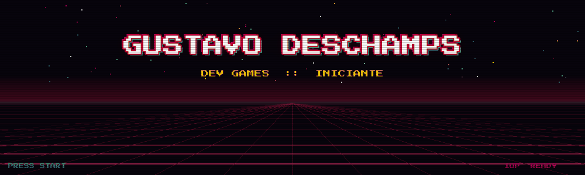
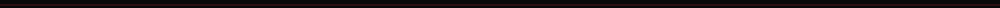
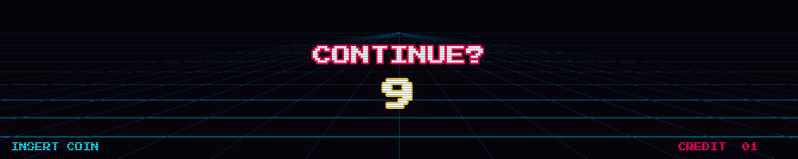

 

 

  

<table align="center">
  <tr>
    <td align="center" width="180"><b>NÍVEL</b></td>
    <td>Iniciante — construindo base sólida antes de correr</td>
  </tr>
  <tr>
    <td align="center"><b>FOCO</b></td>
    <td>Desenvolvimento de jogos (estudando)</td>
  </tr>
  <tr>
    <td align="center"><b>AQUI NO GITHUB</b></td>
    <td>Vou postar meus estudos, protótipos e projetos pequenos</td>
  </tr>
</table>

tudo em aprendizado

<table align="center">
  <tr>
    <td align="right" width="190"><b>GAME ENGINES</b></td>
    <td>
      
      
      
    </td>
  </tr>
  <tr>
    <td align="right"><b>LINGUAGENS</b></td>
    <td>
      
      
    </td>
  </tr>
  <tr>
    <td align="right"><b>WEB</b></td>
    <td>
      
      
    </td>
  </tr>
  <tr>
    <td align="right"><b>FERRAMENTAS</b></td>
    <td>
      
      
      
    </td>
  </tr>
  <tr>
    <td align="right"><b>3D</b></td>
    <td>
      
    </td>
  </tr>
</table>

<b>ABRIR O QUE VEM POR AÍ</b>

 
Em breve: vou fixar aqui meus repositórios de estudo e protótipos.
  

